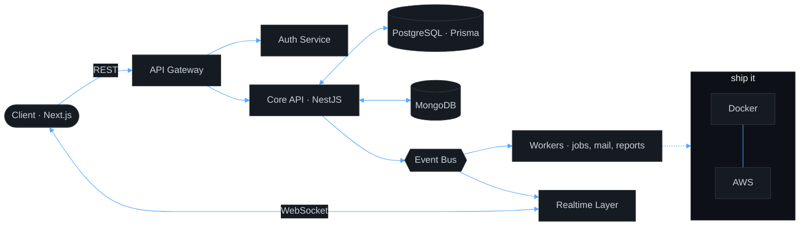
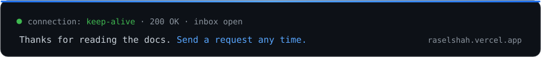

<div align="center">

<!-- Dynamic Typing Header -->


<br/>
<br/>




<br/><br/>


<a href="https://github.com/Raselshah"></a>

</div>


## `GET /about`

```jsonc

{
  "name": "Rasel Shah",
  "role": "Software Engineer",
  "experience": "4+ years",
  "location": "Bangladesh 🇧🇩",
  "specialty": "turning vague requirements into systems that survive traffic",
  "currently": {
    "building": "scalable full-stack applications",
    "learning": ["system design", "microservices", "cloud architecture"],
    "reading":  "logs, mostly"
  },
  "principles": [
    "First, solve the problem. Then, write the code.",
    "Boring technology, interesting problems.",
    "If it isn't measured, it isn't fast."
  ],
  "openTo": ["collaboration", "open source", "hard problems"]
}
```


## `GET /architecture`

The kind of system I spend my days inside — client to event bus to worker, and back out over a socket.




## `GET /endpoints`

| Method | Endpoint | Returns | Status |
| :--- | :--- | :--- | :--- |
| `GET` | `/skills/frontend` | React · Next.js · TypeScript · Redux · Tailwind | `200 OK` |
| `GET` | `/skills/backend` | Node.js · Express · NestJS · REST · WebSockets | `200 OK` |
| `GET` | `/skills/data` | PostgreSQL · MongoDB · Prisma | `200 OK` |
| `GET` | `/skills/infra` | Docker · AWS · Git · CI | `200 OK` |
| `GET` | `/learning` | system design · microservices · event-driven architecture | `206 Partial Content` |
| `POST` | `/collaborate` | open source, side projects, ideas worth building | `202 Accepted` |
| `POST` | `/hire` | full-time and contract enquiries | `202 Accepted` |
| `DELETE` | `/tech-debt` | refactors, DRY passes, performance work | `204 No Content` |
| `GET` | `/free-time` | — | `503 Service Unavailable` |


## `GET /dependencies`

```jsonc
{
  "name": "@rasel/full-stack-engineer",
  "version": "4.2.0",
  "main": "problem-solving.ts",
  "engines": { "curiosity": ">=1.0.0", "coffee": "^2 cups/day" },
  "dependencies": {
    "typescript": "^5.x",
    "react": "^19.x",
    "next": "^15.x",
    "nestjs": "^11.x",
    "express": "^4.x",
    "prisma": "^6.x",
    "postgresql": "*",
    "mongodb": "*"
  },
  "devDependencies": {
    "docker": "*",
    "aws": "*",
    "git": "*",
    "python": "^3.x"
  },
  "scripts": {
    "start": "first, solve the problem",
    "build": "then, write the code",
    "test":  "then, prove it under load"
  }
}
```

<div align="center">
  <br/>
  
  <br/><br/>
  
</div>


## `GET /metrics`

<div align="center">


<br/><br/>


</div>

### `tail -f /var/log/commits`

<div align="center">
  
</div>


## `GET /changelog`

> **`v4.2.0`** — *current*
> Deep in system design. Splitting monoliths, designing event-driven flows, and getting serious about observability.

> **`v4.0.0`** — production scale
> Shipped full-stack products end to end: REST APIs, WebSocket realtime layers, Postgres schema design with Prisma, containerised deploys on AWS.

> **`v2.0.0`** — the backend turn
> Moved from UI work into Node, Express and NestJS. Learned that most frontend problems are actually API design problems.

> **`v1.0.0`** — first commit
> React, curiosity, and far too much `console.log`.


## `GET /sla`

| Metric | Target |
| :--- | :--- |
| First response | under 24 hours |
| Peak hours | 10:00 – 02:00 (UTC+6) |
| Preferred protocol | LinkedIn · email |
| Rate limit | 2 side projects concurrent |
| Accepts | code review, pair debugging, architecture arguments |
| Rejects | "make it like Facebook, budget is $50" |


## `POST /subscribe`


<div align="left">

[](https://github.com/Raselshah)
[](https://www.linkedin.com/in/md-rasel-shah-b085a6228/)
[](https://twitter.com/MdRaselShah5)
[](https://www.facebook.com/mdrasel.shah.92505/)
[](https://raselshah.vercel.app/)

</div>

---

## 💡 Dev Philosophy

<div align="center">

> *"First, solve the problem. Then, write the code."*
>
> — clean code · scalable systems · continuous learning

</div>


<br/>

<div align="center">
  
</div>


<div align="center">


</div>
